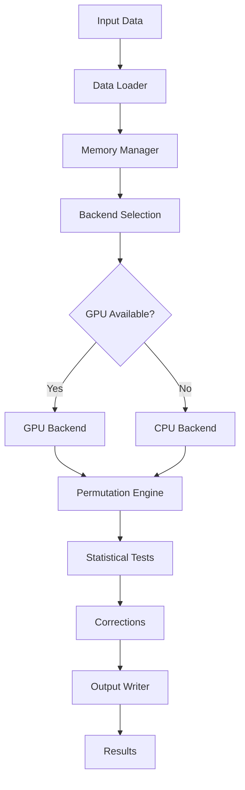

# PLANNING.md - GPU-Accelerated Permutation Testing Project Plan

## Project Vision

### Mission Statement
Build a statistically accurate, GPU-accelerated alternative to FSL randomise that leverages modern GPU architectures (CUDA and Apple Metal Performance Shaders) to achieve 10-100x performance improvements while maintaining <0.001% deviation from the reference implementation.

### Core Values
- **Accuracy First**: Statistical correctness is non-negotiable
- **Performance at Scale**: Optimize for large neuroimaging datasets
- **Developer Experience**: Clean, testable, well-documented code
- **Scientific Rigor**: Validated against established methods
- **Cross-Platform**: Support for both Apple Silicon and NVIDIA GPUs

### Target Outcomes
- Enable researchers to run permutation testing in minutes instead of hours/days
- Democratize access to high-performance neuroimaging analysis
- Establish a maintainable, extensible codebase for future enhancements
- Create a drop-in replacement for FSL randomise with familiar CLI

## System Architecture

### High-Level Architecture Diagram
```
┌─────────────────────────────────────────────────┐
│                  CLI/GUI Interface              │
├─────────────────────────────────────────────────┤
│                   Core Engine                   │
│  ┌──────────┐ ┌──────────┐ ┌──────────┐      │
│  │Statistics│ │Permutation│ │Correction│      │
│  │  Module  │ │  Engine   │ │  Module  │      │
│  └──────────┘ └──────────┘ └──────────┘      │
├─────────────────────────────────────────────────┤
│              Backend Abstraction Layer          │
│  ┌──────────┐ ┌──────────┐ ┌──────────┐      │
│  │   MPS    │ │    CUDA  │ │    CPU   │      │
│  │  Backend │ │  Backend │ │  Backend │      │
│  └──────────┘ └──────────┘ └──────────┘      │
├─────────────────────────────────────────────────┤
│                 Data I/O Layer                  │
│  ┌──────────┐ ┌──────────┐ ┌──────────┐      │
│  │  NIfTI   │ │   Design  │ │  Output   │      │
│  │  Loader  │ │   Loader  │ │  Writer   │      │
│  └──────────┘ └──────────┘ └──────────┘      │
└─────────────────────────────────────────────────┘
```

### Component Responsibilities

#### 1. CLI Interface Layer
- **Purpose**: User interaction and command parsing
- **Components**:
  - `cli.py`: Command-line argument parsing and validation
  - Configuration management
  - Progress reporting and logging
- **Design Pattern**: Command pattern for operation queuing

#### 2. Core Engine Layer
- **Purpose**: Orchestrate statistical computations
- **Components**:
  - `orchestrator.py`: Workflow coordination
  - `statistics.py`: GLM implementation and test statistics
  - `permutation.py`: Permutation strategy implementations
  - `corrections.py`: Multiple comparison correction methods
- **Design Patterns**: 
  - Strategy pattern for permutation methods
  - Template method for statistical tests

#### 3. Backend Abstraction Layer
- **Purpose**: Hardware-agnostic compute interface
- **Components**:
  - `base.py`: Abstract backend interface (ABC)
  - `cpu.py`: NumPy/SciPy implementation
  - `mps.py`: Apple Metal Performance Shaders via PyTorch
  - `cuda.py`: NVIDIA CUDA via PyTorch
- **Design Pattern**: Strategy pattern with factory for backend selection

#### 4. Data I/O Layer
- **Purpose**: Handle neuroimaging data formats
- **Components**:
  - `nifti.py`: NIfTI file reading/writing via nibabel
  - `design.py`: Design matrix and contrast file parsing
  - `output.py`: Statistical map and report generation
- **Design Pattern**: Factory pattern for loader creation

### Data Flow Architecture



### Memory Management Strategy

#### GPU Memory Hierarchy
1. **Level 1**: In-kernel shared memory (fastest)
2. **Level 2**: GPU global memory
3. **Level 3**: Unified/pinned host memory
4. **Level 4**: System RAM (pageable)

#### Chunking Strategy
- Automatic chunking based on available GPU memory
- Overlap computation with data transfer using streams
- Memory pooling to reduce allocation overhead

## Technology Stack

### Core Runtime Dependencies

#### Python Environment
```toml
[project]
name = "gpu-randomise"
version = "0.1.0"
requires-python = ">=3.12"
```

#### Essential Libraries
```toml
[dependencies]
# Core scientific computing
numpy = ">=1.24.0"          # Array operations
scipy = ">=1.11.0"          # Statistical functions

# Neuroimaging I/O
nibabel = ">=5.0.0"         # NIfTI file handling

# GPU acceleration
torch = ">=2.0.0"           # CUDA and MPS backends

# Data validation
pydantic = ">=2.0.0"        # Data validation and settings

# CLI
typer = ">=0.9.0"           # CLI framework
rich = ">=13.0.0"           # Terminal formatting

# Configuration
toml = ">=0.10.0"          # Config file parsing
```

### Development Dependencies

```toml
[dev-dependencies]
# Testing
pytest = ">=7.0.0"          # Test framework
pytest-cov = ">=4.0.0"      # Coverage reporting
pytest-benchmark = ">=4.0.0" # Performance testing
pytest-mock = ">=3.0.0"     # Mocking support
hypothesis = ">=6.0.0"      # Property-based testing

# Code Quality
ruff = ">=0.1.0"            # Linting and formatting
mypy = ">=1.0.0"            # Static type checking
isort = ">=5.0.0"           # Import sorting

# Documentation
sphinx = ">=7.0.0"          # Documentation generation
sphinx-rtd-theme = ">=1.0.0" # ReadTheDocs theme
myst-parser = ">=2.0.0"     # Markdown support

# Development Tools
pre-commit = ">=3.0.0"      # Git hooks
ipython = ">=8.0.0"         # Interactive development
jupyter = ">=1.0.0"         # Notebook support

# Profiling
py-spy = ">=0.3.0"          # Performance profiling
memray = ">=1.0.0"          # Memory profiling
```

### Platform-Specific Requirements

#### Apple Silicon (MPS)
- macOS 12.3+ (Monterey or later)
- PyTorch 2.0+ with MPS support
- Xcode Command Line Tools

#### NVIDIA GPU (CUDA)
- CUDA Toolkit 11.7+
- cuDNN 8.0+
- NVIDIA driver 515+
- PyTorch 2.0+ with CUDA support

#### CPU Fallback
- No additional requirements
- Optional: Intel MKL for optimized BLAS

## Required Tools

### Development Environment Setup

#### 1. Package Manager
```bash
# Install uv (recommended)
curl -LsSf https://astral.sh/uv/install.sh | sh

# Or use pip
pip install --upgrade pip
```

#### 2. Python Version Management
```bash
# Using uv
uv python install 3.12

# Or using pyenv
pyenv install 3.12.0
pyenv local 3.12.0
```

#### 3. Virtual Environment
```bash
# Using uv
uv venv
source .venv/bin/activate  # Unix
.venv\Scripts\activate      # Windows

# Install dependencies
uv pip install -e ".[dev]"
```

#### 4. Pre-commit Hooks
```bash
# Install pre-commit hooks
pre-commit install

# Run manually
pre-commit run --all-files
```

### IDE/Editor Configuration

#### VS Code Extensions
- Python (Microsoft)
- Pylance
- Python Test Explorer
- GitLens
- Better Comments
- Todo Tree

#### VS Code Settings
```json
{
    "python.linting.enabled": true,
    "python.linting.ruffEnabled": true,
    "python.formatting.provider": "ruff",
    "python.testing.pytestEnabled": true,
    "python.testing.unittestEnabled": false,
    "python.analysis.typeCheckingMode": "strict",
    "editor.formatOnSave": true,
    "editor.rulers": [88]
}
```

### Testing Tools

#### Unit Testing
```bash
# Run all tests
pytest

# With coverage
pytest --cov=gpu_randomise --cov-report=html

# Specific module
pytest tests/unit/test_statistics.py

# With verbose output
pytest -vv
```

#### Performance Testing
```bash
# Run benchmarks
pytest benchmarks/ --benchmark-only

# Compare results
pytest-benchmark compare

# Profile specific function
py-spy record -o profile.svg -- python benchmark_script.py
```

#### GPU Testing
```bash
# Check CUDA availability
python -c "import torch; print(torch.cuda.is_available())"

# Check MPS availability
python -c "import torch; print(torch.backends.mps.is_available())"

# GPU memory monitoring (NVIDIA)
nvidia-smi -l 1

# GPU monitoring (Apple)
sudo powermetrics --samplers gpu_power -i 1000
```

### Documentation Tools

#### Sphinx Documentation
```bash
# Build documentation
cd docs
make html

# Live reload for development
sphinx-autobuild . _build/html
```

#### API Documentation
```bash
# Generate API docs from docstrings
sphinx-apidoc -o docs/api src/gpu_randomise
```

### Continuous Integration Tools

#### GitHub Actions Workflow
```yaml
name: CI

on: [push, pull_request]

jobs:
  test:
    runs-on: ${{ matrix.os }}
    strategy:
      matrix:
        os: [ubuntu-latest, macos-latest, windows-latest]
        python-version: ["3.12"]
    
    steps:
    - uses: actions/checkout@v3
    - name: Set up Python
      uses: actions/setup-python@v4
      with:
        python-version: ${{ matrix.python-version }}
    - name: Install dependencies
      run: |
        pip install uv
        uv pip install -e ".[dev]"
    - name: Run tests
      run: pytest --cov
```

### Profiling and Debugging Tools

#### Memory Profiling
```bash
# Profile memory usage
memray run -o output.bin python script.py
memray flamegraph output.bin

# Line-by-line memory profiling
python -m memory_profiler script.py
```

#### GPU Profiling
```bash
# NVIDIA Nsight Systems
nsys profile -o profile python script.py

# PyTorch Profiler
python -c "import torch.profiler; ..."

# Apple Instruments (for MPS)
xcrun xctrace record --template 'Metal System Trace' --launch python script.py
```

### Data Validation Tools

#### Test Data Generation
```python
# Generate synthetic fMRI data
python scripts/generate_test_data.py \
    --voxels 10000 \
    --subjects 50 \
    --output test_data/
```

#### FSL Comparison
```bash
# Run FSL randomise for comparison
randomise -i input.nii -o fsl_output -1 -T -c 3.0 -v 10

# Compare outputs
python scripts/compare_outputs.py \
    our_output.nii \
    fsl_output.nii
```

## Development Workflow

### 1. Feature Development Cycle


### 2. Git Workflow
```bash
# Feature branch
git checkout -b feature/implement-tfce

# Regular commits with conventional commits
git commit -m "feat: add TFCE implementation"
git commit -m "test: add TFCE validation tests"
git commit -m "docs: update TFCE documentation"

# Push and create PR
git push origin feature/implement-tfce
```

### 3. Testing Strategy
1. **Unit Tests**: Test individual functions
2. **Integration Tests**: Test module interactions
3. **Statistical Tests**: Validate accuracy
4. **Performance Tests**: Monitor regressions
5. **End-to-End Tests**: Full workflow validation

### 4. Code Review Checklist
- [ ] Tests pass (unit, integration, statistical)
- [ ] Coverage maintained (>90%)
- [ ] Type hints complete
- [ ] Documentation updated
- [ ] Performance benchmarked
- [ ] Memory usage profiled
- [ ] GPU compatibility verified

## Performance Optimization Strategy

### 1. Profiling First
- Always profile before optimizing
- Focus on bottlenecks (80/20 rule)
- Measure impact of changes

### 2. GPU Optimization Priorities
1. Minimize CPU-GPU transfers
2. Maximize parallelism
3. Optimize memory access patterns
4. Use appropriate precision (float32 vs float64)
5. Batch operations effectively

### 3. Memory Optimization
- Implement memory pooling
- Use in-place operations where possible
- Clear unused tensors explicitly
- Implement chunking for large datasets

### 4. Algorithm Selection
- Choose algorithms based on data size
- Full enumeration for small samples
- Monte Carlo for large samples
- Adaptive thresholds for method selection

## Risk Mitigation Strategies

### Technical Risks
1. **GPU Memory Limitations**
   - Solution: Automatic chunking
   - Fallback: CPU processing

2. **Numerical Precision**
   - Solution: Extensive validation
   - Mixed precision options

3. **Platform Compatibility**
   - Solution: Abstract backend interface
   - Comprehensive testing matrix

### Project Risks
1. **Scope Creep**
   - Solution: Phased development
   - Clear milestone boundaries

2. **Performance Targets**
   - Solution: Early benchmarking
   - Alternative algorithms ready

## Quality Assurance Plan

### Code Quality Gates
1. **Pre-commit Checks**
   - Formatting (ruff, isort)
   - Linting (ruff)
   - Type checking (mypy)

2. **CI/CD Pipeline**
   - Unit tests must pass
   - Coverage > 90%
   - No performance regressions
   - Documentation builds

3. **Release Criteria**
   - All tests passing
   - Performance targets met
   - Documentation complete
   - Validation against FSL complete

## Communication and Collaboration

### Documentation Standards
- README.md: Quick start and overview
- CLAUDE.md: Development guide
- PRD.md: Requirements
- PLANNING.md: This file
- TASKS.md: Task tracking
- SCRATCHPAD.md: Working notes

### Progress Tracking
- Update TASKS.md after each session
- Mark completed items immediately
- Add new discovered tasks
- Regular status updates in SCRATCHPAD.md

### Code Documentation
- NumPy-style docstrings
- Type hints for all public APIs
- Inline comments for complex logic
- Example usage in docstrings

## Next Steps Checklist

### Immediate Actions (Week 1)
- [ ] Set up project structure
- [ ] Configure development environment
- [ ] Initialize Git repository
- [ ] Set up CI/CD pipeline
- [ ] Create initial test suite structure

### Short-term Goals (Weeks 2-4)
- [ ] Implement core architecture
- [ ] Create backend abstraction
- [ ] Develop CPU backend
- [ ] Basic NIfTI I/O
- [ ] GLM implementation

### Medium-term Goals (Weeks 5-12)
- [ ] MPS backend implementation
- [ ] CUDA backend implementation
- [ ] Permutation strategies
- [ ] TFCE implementation
- [ ] Performance optimization

### Long-term Goals (Weeks 13-18)
- [ ] Comprehensive validation
- [ ] Documentation completion
- [ ] Example notebooks
- [ ] Community feedback
- [ ] Release preparation

## Success Metrics Dashboard

### Performance Metrics
- [ ] 10x speedup vs FSL randomise
- [ ] <60s for large dataset (250k voxels, 100 subjects, 10k permutations)
- [ ] GPU utilization >80%
- [ ] Memory efficiency <2x theoretical minimum

### Quality Metrics
- [ ] Test coverage >90%
- [ ] Statistical accuracy <0.001% deviation
- [ ] Zero critical bugs
- [ ] Documentation coverage 100%

### User Experience Metrics
- [ ] CLI compatibility with FSL
- [ ] Installation time <5 minutes
- [ ] Clear error messages
- [ ] Comprehensive examples

## Revision History

| Date | Version | Changes | Author |
|------|---------|---------|--------|
| 2024-01-XX | 0.1.0 | Initial planning document | Team |

---

**Remember**: This is a living document. Update it as the project evolves and new insights emerge.